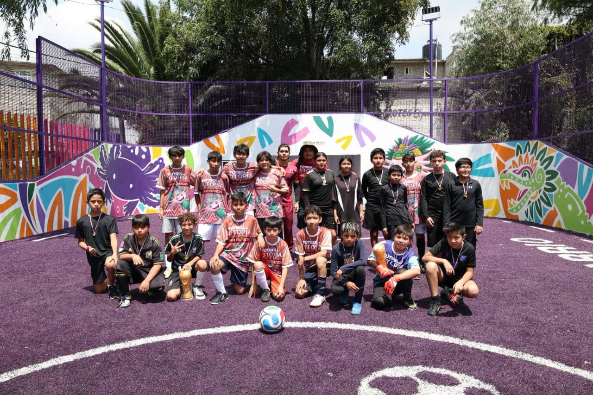
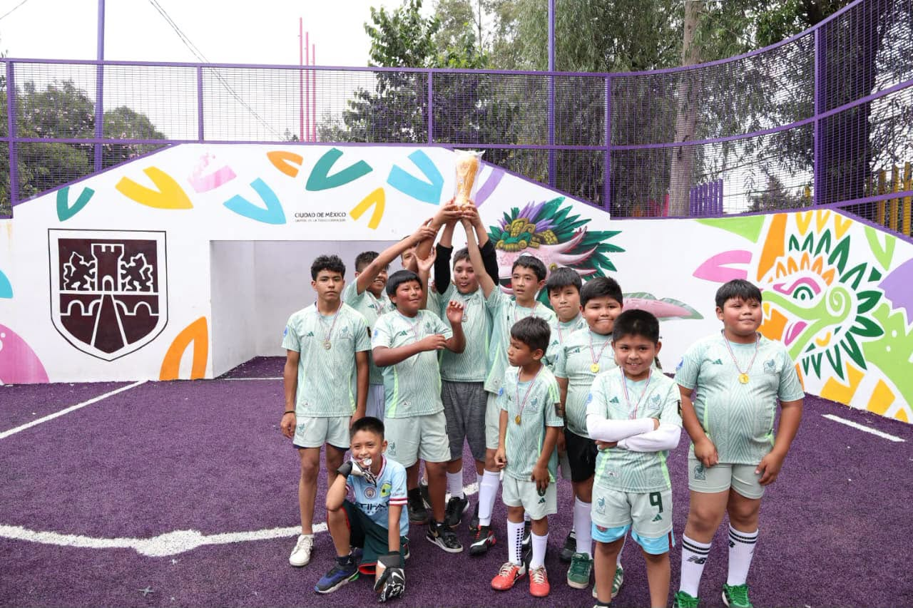
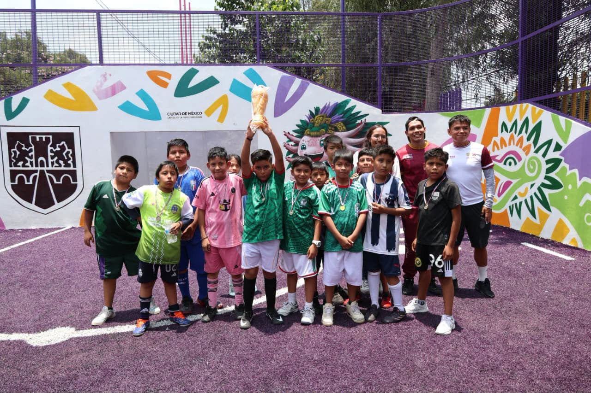
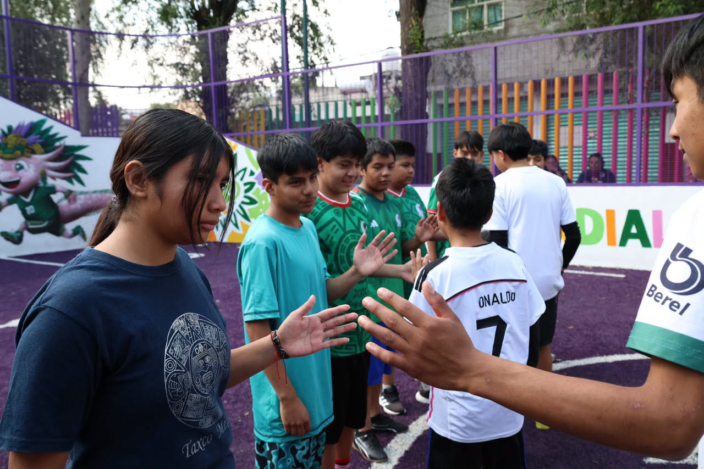
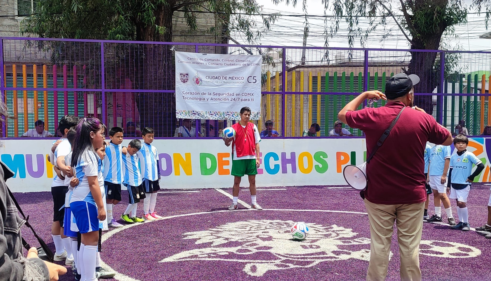
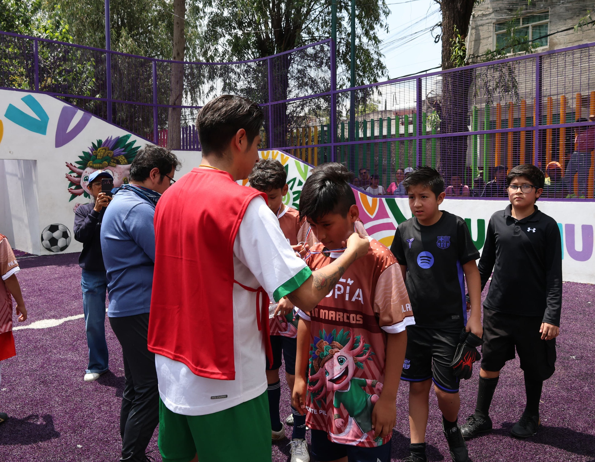

# Reunión sobre Territorios de Paz

El día 8 de julio de 2026 asistí a una reunión denominada: *INSTALACIÓN DE GABINETES TERRITORIAL DE LA ESTRATEGIA DE TERRITORIOS DE PAZ E IGUALDAD*. No es un secreto que actualmente me desempeño como servidor público en cierta dependencia de gobierno. El objetivo fue informarnos sobre los avances del programa [territorios de paz e igualdad](https://jefaturadegobierno.cdmx.gob.mx/comunicacion/nota/presenta-clara-brugada-el-programa-territorios-de-paz-e-igualdad-que-combate-las-causas-de-la-violencia-y-la-exclusion) que la Secretaria de Atención y Participación Ciudadana lleva a cabo:

> "El Gobierno de la Ciudad de México, a través de la Secretaría de Atención y Participación Ciudadana, convoca a niñas, niños, adolescentes, juventudes, comunidades y equipos de los 32 Territorios de Paz e Igualdad a participar en el: Primer Mundialito Recreativo Territorios de Paz e Igualdad 2026"

El objetivo de este artículo de opinión solo es dar mi punto de vista sobre la estrategía de seguridad de la Ciudad de México y sobre lo platicado en la reunión porque se expusieron varios temas que considero importantes y necesarios para la transformación de una sociedad que busca igualdad, justica, solidaridad y hermandad en sus ciudadanos.

Primero que nada hablemos de las bases filosóficas en las que se fundamentan los territorios de paz:

- Rescate de saberes de los pueblos originarios

- Paz positiva (Johan Galtung)

- Pensamiento Decolonial

- Humanismo Mexicano

- Educación popular (Paulo freire)

Históricamente los saberes de los pueblos originarios han sido olvidados y marginados. Recuerdo que en mi juventud, me refiero a mis años en preparatoria, surgió en mi un gran interés por aprender a hablar la lengua nahuátl. Exactamente no recuerdo cuál fue el detonante de mi curiosidad, pero lo poco que recuerdo es lo poético que sonaba todo, es decir, la manera de referirse a las cosas con amor y respeto me resultaba muy atractivo, me conmovia y quería aprender a expresarme de la misma forma. Empece por tomar clases en el Faro de Oriente, la mayoria de los alumnos en el curso eran mayores de edad, cerca del 90%.

Al vivir en una de las alcaldías con mayores índices de incidencia delictiva, vives la violencia a flor de piel es una especie de ley de la selva donde nadie respeta nada, ni siquiera se respetan a las insticiones encargadas de hacer cumplir la ley porque ellos mismos no te respetan. A los 17 años me subieron a la patrulla por estar reunidos en la vía pública con otros compañeros y nos implantaron marihuana, nos dieron vueltas por la manzana para intimidarnos y preocupar a nuestros familiares. Territorios de paz busca transformar las condiciones estructurales que generan violencia, desigualdad y exclusión, en la que participan todas las dependencias e instancias del gobierno capitalino.

La propuesta de rescatar la cosmovisión de los pueblos originarios por lo tanto me parece una estrategia de alto valor, no solo por lo anterior, sino porque además se recupera el respeto por la naturaleza y se recupera la memoria histórica de nuestros antepasados aztecas, mexicas, olmecas, etc, pioneros en diferentes áreas del conocimiento humano a la altura de culturas eurocentricas y occidentales. Y este punto se complementa con la decolonización[^1] del pensamiento, aquí claramente podriamos decir que se basan en las ideas de Enrique Dussel y otros pensadores. Hay tanta riqueza cultural en latinoamerica y conomiento que es sorprendente que no seamos quienes estan liderando en diferentes campos del interés humano. ¿Por qué esto es así? 

Por otro lado el [Humanismo Mexicano](https://filosofiamexicana.org/2025/02/26/brevisima-relacion-del-humanismo-mexicano/), corriente filosófica que Andres Manuel López Obrador populariza en el imaginario colectivo mexicano para forjar identidad nacional en el pueblo y definir el modelo aplicado por la cuarta transformación. Por medio de lo que el mismo denominó las *benditas redes sociales*  ganó seguidores posicionandolo como [el segundo presidente con mayor aceptación](https://forbes.com.mx/amlo-presume-mantenerse-como-el-segundo-presidente-con-mayor-aceptacion-del-mundo/). Este movimiento cultural y ético surgió desde el siglo XVI, fundamentado en el humanismo republicano crítico de la Conquista que buscó forjar una identidad nacional distinta a la española, reconociendo la grandeza de las culturas indígenas. Por tanto no es nada nuevo, solo fue una actualización ideológica sustituyendo a la monarquía española con la dictadura perfecta que el PRI ejerció por más de 80 años sobre el pueblo mexicano y que nos ha mantenido como el patió trasero de estados unidos, a merced del neoliberalismo y el sector privado.

La Educación Popular, desarrollada por el pedagogo brasileño [Paulo Freire](https://revistaizquierda.com/paulo-freire-y-la-sintesis-pedagogica-de-una-tradicion-revolucionaria-la-educacion-popular-iii%EF%BF%BC/), es una corriente pedagógica y política que busca la liberación de los sectores oprimidos mediante la concientización y la transformación social. Se contrapone a la educación bancaria tradicional, donde el docente deposita conocimiento pasivo, promoviendo en su lugar una relación horizontal donde educador y educando aprenden mutuamente. 

Sus características principales incluyen: diálogo y participación, pensamiento crítico y una praxis transformadora. Valores clave para en la construcción de Territorios de paz con ciudadano críticos capaces de reflexionar sobre la realidad su realidad para identificar y cuestionar las estructuras de dominación y construir una sociedad más justa y equitativa.

En este sentido la dependencia de gobierno  de la cual formo parte, el C5, fue participé del mundialito en Pedregal de santo Domingo, Xochimilco los días 11 y 12 de Julio. Organizando un torneo de futbol con el objetivo de fortalecer la convivencia, la inclusión, la participación comunitaria, en diferentes categorías, especificamente:

- Infantil mixto de 9 a 11 años 

- Adolescentes mixto de 12 a 14 años

- Juventudes Varonil 15 a 17 años 

- Juventudes Femenil 15 a 17 años

Participé como arbitro en diferentes partidos. Fue una nueva experiencia, que me dejó muchos aprendizajes. Nunca antes había sido arbitro, siempre he sido jugador nunca quién da comienzo y fin a un encuentro. Que difícil llegar a acuerdos cuando has tomado una desición sobre una jugada, en espacial cuando es una jugada fuerte donde alguien sale lástimado por muy mínimo que sea. Al estar en juego la victoria y el orgullo de un equipo nadie quiere ver perjudicados estos valores para su equipo y siendo una categoría infantil, viendo tristes a sus hijos por la derrota. Es por eso que antes y después de cada encuentro se hizo enfásis a todos los participantes que la finalidad del Mundialito era la reconstrucción del tejido social, la solidaridad,  promover los valores de justicia, paz e igualdad en las colonias que históricamente han sido menos beneficiadas por el gobierno mexicano en turno.

Dejo algunas imagenes del evento:

  
  
  
  

   

Imagenes tomadas de la [cuenta oficial del C5](https://web.facebook.com/permalink.php?story_fbid=pfbid02JVVLR3s5pYxE3KxJcXG4sxQVnhhSx9zKqXYMJtKgvw6jrWwMGXW9iKnzToVWicyRl&id=100064946580085) de la ciudad de México en Facebook.

  
  

  

Imágenes propias.
 
[^1]: Decolonizar el pensamiento es una acción crítica de desconstrucción de ideas, teorías y saberes que perpetúan la dependencia filosófico-intelectual del colonialismo y el eurocentrismo. 